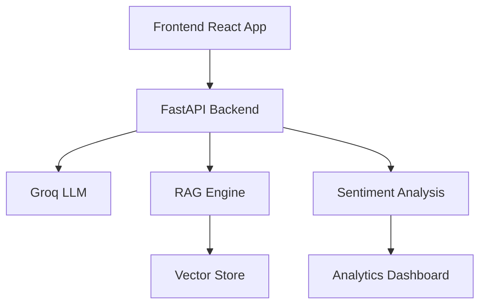

# 🎯 EventMate AI - Intelligent Event Discovery Platform


## 📋 Table of Contents
- [Overview](#overview)
- [Key Features](#key-features)
- [Tech Stack](#tech-stack)
- [Getting Started](#getting-started)
- [API Documentation](#api-documentation)
- [Feature Details](#feature-details)
- [Architecture](#architecture)
- [Contributing](#contributing)

## 🌟 Overview

EventMate AI is a cutting-edge event discovery platform that combines AI-powered recommendations, community engagement, and real-time sentiment analysis. Our solution leverages advanced RAG (Retrieval-Augmented Generation) techniques and the Groq LLM to provide personalized event experiences.

## 🚀 Key Features

### 1. AI Event Assistant
- Voice-enabled natural language queries
- Context-aware recommendations
- Real-time sentiment analysis
- Multi-turn conversations

### 2. Event Discovery
- Location-based filtering
- Category exploration
- Time-of-day optimization
- Personalized recommendations

### 3. Community Features
- Interest-based matching
- Friend finder
- Community groups
- Real-time engagement metrics

### 4. Sentiment Analysis
- Real-time feedback processing
- Trend detection
- Community mood tracking
- Event success prediction

## 🛠️ Tech Stack

### Frontend
```json
{
  "framework": "React + TypeScript",
  "styling": "TailwindCSS",
  "animations": "AOS (Animate On Scroll)",
  "state": "React Hooks",
  "routing": "React Router",
  "icons": "Lucide React"
}
```

### Backend
```json
{
  "framework": "FastAPI",
  "llm": "Groq",
  "embeddings": "Sentence Transformers",
  "analysis": "NumPy",
  "database": "SQLite (development)"
}
```

## 📥 Getting Started

### Prerequisites
```bash
# Required software
- Node.js (v16+)
- Python (3.8+)
- pip
- git
```

### Environment Setup

1. **Clone Repository**
```bash
git clone https://github.com/yourusername/eventmate-ai.git
cd eventmate-ai
```

2. **Backend Setup**
```bash
# Create virtual environment
python -m venv venv
source venv/bin/activate  # Windows: .\venv\Scripts\activate

# Install dependencies
pip install -r requirements.txt

# Set up environment variables
cp .env.example .env
# Edit .env with your API keys

# Start FastAPI server
uvicorn fast:app --reload
```

3. **Frontend Setup**
```bash
# Install dependencies
npm install

# Start development server
npm run dev
```

## 🔌 API Documentation

### Core Endpoints

```typescript
// Chat Endpoints
POST /chatbot     // AI event assistant
POST /chat        // General conversation

// Event Endpoints
GET  /events      // List all events
GET  /events/{id} // Get specific event

// User Endpoints
GET  /users       // List users
POST /match/users // Match users by interests

// Community Endpoints
GET  /communities        // List communities
POST /match/communities // Find matching communities
```

## 🎯 Feature Details

### RAG Implementation
```python
def process_query(query):
    # Semantic Chunking
    chunks = chunk_text(data)
    
    # Embedding & Ranking
    ranked_chunks = rank_by_similarity(query, chunks)
    
    # Context Assembly
    context = assemble_context(ranked_chunks)
    
    # LLM Processing
    response = process_with_groq(query, context)
    
    return format_response(response)
```

### Voice Recognition
- Real-time transcription
- Multiple language support
- Noise cancellation
- Continuous mode

### Sentiment Analysis
- Real-time processing
- Emotion detection
- Trend analysis
- Actionable insights

## 🏗️ Architecture



## 🤝 Contributing

1. Fork the repository
2. Create feature branch
3. Commit changes
4. Push to branch
5. Open pull request

## 📝 License

MIT License - see [LICENSE.md](LICENSE.md)

## 🆘 Support

- Documentation: [docs/](./docs)
- Issues: GitHub Issues
- Email: support@eventmate.ai
- Discord: [Join Community](https://discord.gg/eventmate)

---

### 🌟 Star History

[](https://star-history.com/#yourusername/eventmate-ai&Date)

---

Built with ❤️ for developers, by developers.
