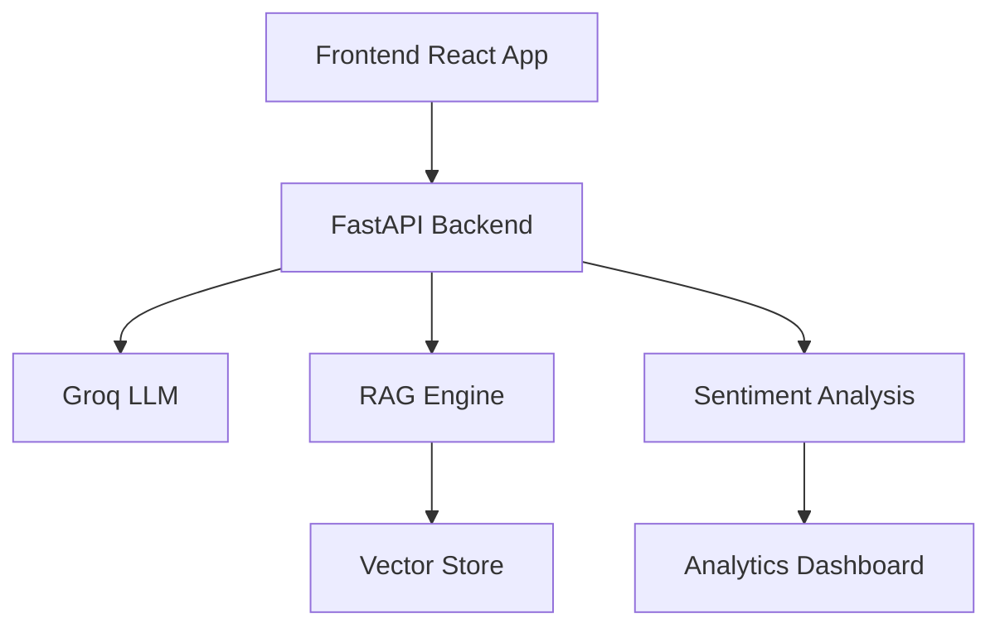

# EventMate AI

Welcome to **EventMate AI**, an intelligent event discovery platform that leverages cutting-edge AI technologies to deliver personalized event experiences. Whether you're looking to attend local gatherings, explore new categories, or connect with like-minded individuals, EventMate AI has you covered.

## Table of Contents

1. [Overview](#overview)
2. [Key Features](#key-features)
3. [Tech Stack](#tech-stack)
4. [Demo](#demo)
5. [Getting Started](#getting-started)
6. [API Documentation](#api-documentation)
7. [Feature Details](#feature-details)
8. [Architecture](#architecture)
---

## 🌟 Overview

EventMate AI is a state-of-the-art event discovery platform that combines AI-powered recommendations, community engagement, and real-time sentiment analysis to offer a seamless and personalized event browsing experience. Utilizing advanced Retrieval-Augmented Generation (RAG) techniques and the Groq Large Language Model (LLM), EventMate AI ensures users find events that perfectly match their preferences and interests.

---

## 🚀 Key Features

### 1. AI Event Assistant
- **Voice-Enabled Queries:** Interact with the platform using natural language voice commands.
- **Context-Aware Recommendations:** Receive event suggestions based on your current context and past interactions.
- **Real-Time Sentiment Analysis:** Gauge the community's mood and feedback in real-time.
- **Multi-Turn Conversations:** Engage in dynamic conversations to refine your event search.

### 2. Event Discovery
- **Location-Based Filtering:** Discover events happening near your current location or any specified area.
- **Category Exploration:** Browse events across various categories such as music, tech, sports, and more.
- **Time-of-Day Optimization:** Get event suggestions tailored to your preferred times.
- **Personalized Recommendations:** Enjoy a curated list of events that align with your interests and past activities.

### 3. Community Features
- **Interest-Based Matching:** Connect with users who share similar interests and passions.
- **Friend Finder:** Discover and add friends within the platform to enhance your event experiences.
- **Community Groups:** Join or create groups centered around specific interests or event types.
- **Real-Time Engagement Metrics:** Monitor community interactions and engagement levels.

### 4. Sentiment Analysis
- **Real-Time Feedback Processing:** Analyze user feedback as it happens to improve event offerings.
- **Trend Detection:** Identify and capitalize on emerging trends within the community.
- **Community Mood Tracking:** Keep a pulse on the overall sentiment and satisfaction of users.
- **Event Success Prediction:** Forecast the potential success of events based on current data.

---

## 🛠️ Tech Stack

### Frontend
- **Framework:** React + TypeScript
- **Styling:** TailwindCSS
- **Animations:** AOS (Animate On Scroll)
- **State Management:** React Hooks
- **Routing:** React Router
- **Icons:** Lucide React

### Backend
- **Framework:** FastAPI
- **Language Model:** Groq LLM
- **Embeddings:** Sentence Transformers
- **Data Analysis:** NumPy
- **Database:** SQLite (development)

### Additional Technologies
- **Voice Recognition:** Integrated for voice-enabled queries.
- **Real-Time Processing:** Ensures instantaneous sentiment analysis and feedback processing.

---

## 🎥 Demo


Experience EventMate AI in action! [Watch the Demo Video](https://www.youtube.com/your-demo-link)

---

## 📥 Getting Started

Follow these steps to set up and run EventMate AI locally.

### 📝 Prerequisites

- **Node.js:** v16+
- **Python:** 3.8+
- **pip:** Python package installer
- **Git:** Version control system

### 📦 Installation

1. **Clone the Repository**
   ```bash
   git clone https://github.com/yourusername/eventmate-ai.git
   cd eventmate-ai
   ```

2. **Backend Setup**

   - **Create Virtual Environment**
     ```bash
     python -m venv venv
     source venv/bin/activate  # Windows: .\venv\Scripts\activate
     ```

   - **Install Dependencies**
     ```bash
     pip install -r requirements.txt
     ```

   - **Configure Environment Variables**
     ```bash
     cp .env.example .env
     ```
     - Open `.env` and add your API keys and necessary configurations.

   - **Start FastAPI Server**
     ```bash
     uvicorn fast:app --reload
     ```

3. **Frontend Setup**

   - **Install Dependencies**
     ```bash
     npm install
     ```

   - **Start Development Server**
     ```bash
     npm run dev
     ```
   - Open [http://localhost:3000](http://localhost:3000) in your browser to view the application.

---

## 📄 API Documentation

EventMate AI provides a robust API to interact with various features of the platform. Below is an overview of the core endpoints.

### 🔌 Core Endpoints

#### Chat Endpoints
- **POST** `/chatbot`  
  *AI event assistant for handling event-related queries.*

- **POST** `/chat`  
  *General conversation endpoint for miscellaneous interactions.*

#### Event Endpoints
- **GET** `/events`  
  *Retrieve a list of all events.*

- **GET** `/events/{id}`  
  *Retrieve details of a specific event by ID.*

#### User Endpoints
- **GET** `/users`  
  *Retrieve a list of all users.*

- **POST** `/match/users`  
  *Match users based on interests and criteria.*

#### Community Endpoints
- **GET** `/communities`  
  *Retrieve a list of all communities.*

- **POST** `/match/communities`  
  *Find communities that match specified interests or keywords.*

### 📚 Detailed API Routes

For comprehensive API documentation, including request and response schemas, authentication methods, and example payloads, please refer to the [API Documentation](./docs/API.md).

---

## 🎯 Feature Details

### Retrieval-Augmented Generation (RAG) Implementation

EventMate AI uses RAG techniques to enhance the relevance and accuracy of its recommendations. Here's a brief overview of how it processes user queries:

```python
def process_query(query):
    # Semantic Chunking
    chunks = chunk_text(data)
    
    # Embedding & Ranking
    ranked_chunks = rank_by_similarity(query, chunks)
    
    # Context Assembly
    context = assemble_context(ranked_chunks)
    
    # LLM Processing
    response = process_with_groq(query, context)
    
    return format_response(response)
```

### Voice Recognition

- **Real-Time Transcription:** Converts spoken queries into text instantaneously.
- **Multiple Language Support:** Interacts in various languages to cater to a diverse user base.
- **Noise Cancellation:** Ensures accurate transcription even in noisy environments.
- **Continuous Mode:** Allows for ongoing voice interactions without needing to activate manually.

### Sentiment Analysis

- **Real-Time Processing:** Analyzes feedback as it comes in to provide up-to-date insights.
- **Emotion Detection:** Identifies emotions expressed in user feedback.
- **Trend Analysis:** Tracks and identifies trends over time within the community.
- **Actionable Insights:** Provides data-driven recommendations based on sentiment analysis.

---

## 🏗️ Architecture

EventMate AI is built on a modular architecture that ensures scalability, maintainability, and efficiency. Below is an overview of the system architecture:




### Components

1. **Frontend:**  
   Built with React and TypeScript, the frontend provides a responsive and interactive user interface. TailwindCSS ensures consistent styling, while AOS adds engaging animations.

2. **Backend:**  
   Powered by FastAPI, the backend handles API requests, business logic, and interactions with the database. It integrates with the Groq LLM for natural language processing and utilizes Sentence Transformers for embedding generation.

3. **Database:**  
   SQLite is used for development purposes, offering a lightweight and easy-to-use solution. For production, consider migrating to more robust databases like PostgreSQL.

4. **AI Services:**  
   - **Groq LLM:** Facilitates advanced natural language understanding and generation.
   - **Sentence Transformers:** Generates embeddings for semantic similarity tasks.
   - **NumPy:** Handles numerical computations and data analysis.

5. **Middleware:**  
   CORS middleware ensures secure and controlled cross-origin requests.

