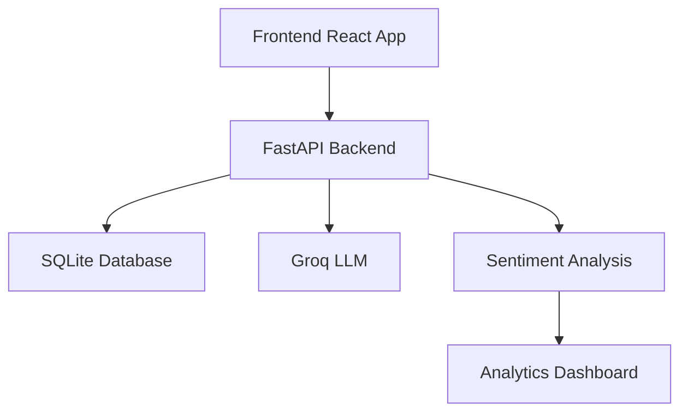

# Kynnovate


Welcome to **Kynnovate**, an innovative platform designed to revolutionize the way you discover, manage, and engage with events. Leveraging cutting-edge technologies and a user-centric design, Kynnovate provides a seamless experience for both event organizers and attendees. Whether you're looking to host a virtual conference, attend a local meetup, or connect with like-minded individuals, Kynnovate has you covered.

---

## 📋 Table of Contents

1. [🌟 Overview](#-overview)
2. [🚀 Key Features](#-key-features)
3. [🛠️ Tech Stack](#-tech-stack)
4. [🎥 Demo](#-demo)
5. [📥 Getting Started](#-getting-started)
    - [🔧 Prerequisites](#-prerequisites)
    - [📦 Installation](#-installation)
        - [1. Clone the Repository](#1-clone-the-repository)
        - [2. Backend Setup](#2-backend-setup)
        - [3. Frontend Setup](#3-frontend-setup)
6. [📄 API Documentation](#-api-documentation)
7. [🏗️ Architecture](#-architecture)
8. [🎯 Feature Details](#-feature-details)


---

## 🌟 Overview

**Kynnovate** is a comprehensive event management and discovery platform that bridges the gap between event organizers and attendees. By integrating advanced AI-driven features, real-time analytics, and a robust community engagement system, Kynnovate ensures that every event is a success and every attendee has a memorable experience.

### Key Objectives

- **For Organizers:** Streamline event creation, management, and promotion.
- **For Attendees:** Discover events tailored to their interests and connect with like-minded individuals.
- **For Community:** Foster a vibrant community through interactive features and real-time feedback.

---

## 🚀 Key Features

### 1. AI-Powered Event Recommendations
- **Personalized Suggestions:** Receive event recommendations based on your interests, past activities, and location.
- **Smart Search:** Utilize natural language processing to find events effortlessly.

### 2. Comprehensive Event Management
- **Easy Event Creation:** Simple tools for organizers to create and manage events.
- **Ticketing System:** Integrated ticket sales with secure payment processing.
- **Real-Time Analytics:** Monitor event performance with real-time data insights.

### 3. Community Engagement
- **User Profiles:** Create detailed profiles to showcase interests and connect with others.
- **Forums & Groups:** Participate in discussions and join groups related to specific event categories.
- **Real-Time Chat:** Engage with other attendees and organizers through integrated chat features.

### 4. Real-Time Feedback & Sentiment Analysis
- **Live Polls & Surveys:** Gather instant feedback from attendees during events.
- **Sentiment Tracking:** Analyze community sentiment to improve future events.

### 5. Multi-Platform Support
- **Responsive Design:** Access Kynnovate seamlessly across web and mobile devices.
- **API Integration:** Extend functionality with a robust API for third-party integrations.

---

## 🛠️ Tech Stack

### Frontend
- **Framework:** React.js
- **Language:** TypeScript
- **Styling:** TailwindCSS
- **Animations:** AOS (Animate On Scroll)
- **State Management:** Redux Toolkit
- **Routing:** React Router
- **Icons:** Lucide React

### Backend
- **Framework:** FastAPI
- **Language Model:** Groq LLM
- **Embeddings:** Sentence Transformers
- **Data Analysis:** NumPy, Pandas
- **Database:** SQLite (development), PostgreSQL (production)
- **Authentication:** JWT (JSON Web Tokens)

### Additional Technologies
- **Voice Recognition:** Integrated for voice-enabled queries.
- **Real-Time Processing:** WebSockets for real-time interactions.
- **Containerization:** Docker & Docker Compose for easy deployment.
- **CI/CD:** GitHub Actions for automated testing and deployment.

---

## 🎥 Demo

Experience **Kynnovate** in action! Watch our [Demo Video](https://drive.google.com/file/d/1CNhHimUwqtYOz-9ltGnZ1acoeLGMjQpD/view) to see how our platform can transform your event experience.


---

## 📥 Getting Started

Follow these steps to set up and run **Kynnovate** locally.

### 🔧 Prerequisites

Before you begin, ensure you have the following installed on your machine:

- **Node.js:** v16+ ([Download Node.js](https://nodejs.org/))
- **Python:** 3.8+ ([Download Python](https://www.python.org/downloads/))
- **pip:** Python package installer (comes with Python)
- **Git:** Version control system ([Download Git](https://git-scm.com/downloads))
- **Docker:** (Optional, for containerization) ([Download Docker](https://www.docker.com/get-started))

### 📦 Installation

#### 1. Clone the Repository

First, clone the GitHub repository to your local machine.

```bash
git clone https://github.com/Rohit-Yadav-47/Kynnovate.git
cd Kynnovate
```

#### 2. Backend Setup

The backend is built using FastAPI and handles all server-side operations.

##### a. Navigate to the Backend Directory

```bash
cd backend
```

##### b. Set Up a Virtual Environment

Creating a virtual environment helps manage project-specific dependencies.

- **Create the Virtual Environment**

  ```bash
  python -m venv venv
  ```

- **Activate the Virtual Environment**

  - **On macOS/Linux:**

    ```bash
    source venv/bin/activate
    ```

  - **On Windows:**

    ```bash
    .\venv\Scripts\activate
    ```

  After activation, your terminal prompt should be prefixed with `(venv)`.

##### c. Install Dependencies

Install the required Python packages listed in `requirements.txt`.

```bash
pip install --upgrade pip
pip install -r requirements.txt
```

##### d. Start the Backend Server

Launch the FastAPI server using Uvicorn.

```bash
uvicorn main:fast --reload
```

- **`main`** refers to the `main.py` file.
- **`app`** is the FastAPI instance inside `main.py`.
- **`--reload`** enables auto-reloading on code changes (useful for development).

> **Access the API:** Open [http://localhost:8000](http://localhost:8000) in your browser.

#### 3. Frontend Setup

The frontend is built using React.js and provides the user interface for Kynnovate.

##### a. Navigate to the Frontend Directory

From the root of the repository (assuming frontend is in the main folder):

```bash
cd ..
```

##### b. Install Dependencies

Install the required Node.js packages listed in `package.json`.

```bash
npm install
```

##### c. Start the Development Server

Launch the React development server.

```bash
npm run dev
```

> **Access the Application:** Open [http://localhost:3000](http://localhost:3000) in your browser to view the application.

---
## 📄 API Documentation

Kynnovate provides a comprehensive API to interact with various features of the platform. Below is an overview of the core endpoints and their respective schemas.

### 🔌 Core Endpoints

#### **Chat Endpoints**
- **POST** `/chatbot`  
  *Chatbot Endpoint*

- **POST** `/chat`  
  *Chat Endpoint*

#### **Event Endpoints**
- **GET** `/events`  
  *Get Events*

- **GET** `/events/{event_id}`  
  *Get Event*

#### **User Endpoints**
- **GET** `/users`  
  *Get Users Endpoint*

- **GET** `/users/{user_id}`  
  *Get User Endpoint*

- **GET** `/users/{user_id}/full`  
  *Get User Full Profile*

- **POST** `/match/users`  
  *Match Users Endpoint*

- **POST** `/users/match`  
  *Match Users*

#### **Community Endpoints**
- **GET** `/communities`  
  *Get Communities Endpoint*

- **GET** `/communities/{community_id}`  
  *Get Community Endpoint*

- **POST** `/match/communities`  
  *Match Communities Endpoint*

#### **Health Check Endpoint**
- **GET** `/health`  
  *Health Check*

### 📚 Schemas

The following schemas define the structure of the data returned by the API endpoints.

- **Community**
  - Detailed structure of the Community object.

- **Event**
  - Detailed structure of the Event object.

- **HTTPValidationError**
  - Structure for validation error responses.

- **User**
  - Detailed structure of the User object.

- **ValidationError**
  - Structure for general validation errors.

---

## 🏗️ Architecture

Kynnovate is built on a modular architecture that ensures scalability, maintainability, and efficiency. Below is an overview of the system architecture:



### Components

1. **Frontend:**
   - **Technology:** React.js with TypeScript
   - **Responsibilities:** 
     - Render user interfaces
     - Handle user interactions
     - Communicate with the backend via API calls
     - Manage state using Redux Toolkit

2. **Backend:**
   - **Technology:** FastAPI
   - **Responsibilities:**
     - Handle API requests
     - Business logic and data processing
     - Integrate with AI services like Groq LLM and Sentiment Analysis

3. **Database:**
   - **Technology:** SQLite (development), PostgreSQL (production)
   - **Responsibilities:**
     - Store user data, event details, tickets, and other relational data
     - Ensure data integrity and support complex queries

4. **AI Services:**
   - **Groq LLM:** Facilitates advanced natural language understanding and generation.
   - **Sentiment Analysis:** Analyzes user feedback to gauge community sentiment.

5. **Analytics Dashboard:**
   - **Technology:** Integrated within the backend for real-time insights.
   - **Responsibilities:**
     - Display analytics data
     - Monitor event performance and user engagement

---

## 🎯 Feature Details

### 1. AI-Powered Event Recommendations

Kynnovate leverages machine learning algorithms to provide personalized event recommendations based on user behavior, preferences, and contextual data.

```python
def recommend_events(user_id):
    user_preferences = get_user_preferences(user_id)
    events = fetch_events()
    recommended = apply_ml_model(user_preferences, events)
    return recommended
```

### 2. Real-Time Chat and Notifications

Using WebSockets, Kynnovate supports real-time communication between users and instant notifications for event updates.

- **WebSockets:** Enable live chat features and real-time updates.
- **Notifications:** Inform users about event changes, new events, and community activities.

### 3. Ticketing System

A robust ticketing system allows users to purchase, view, and manage their event tickets seamlessly.

- **Secure Payments:** Integrated with trusted payment gateways.
- **Ticket Generation:** Generate unique tickets with QR codes for entry verification.

### 4. Community Forums and Groups

Foster a sense of community by allowing users to join forums and groups based on their interests and event categories.

- **Discussion Threads:** Engage in meaningful conversations.
- **Group Management:** Create and manage groups with specific themes or topics.

### 5. Real-Time Feedback and Sentiment Analysis

Gather instant feedback from attendees during events and analyze community sentiment to improve future events.

- **Live Polls:** Conduct polls to gauge attendee opinions.
- **Sentiment Analysis:** Utilize natural language processing to assess the overall mood and satisfaction.

### 6. Multi-Language Support

Ensure accessibility for a global audience by supporting multiple languages across the platform.

- **Internationalization (i18n):** Easily switch between different languages.
- **Localization:** Adapt content to fit regional preferences and norms.

---


